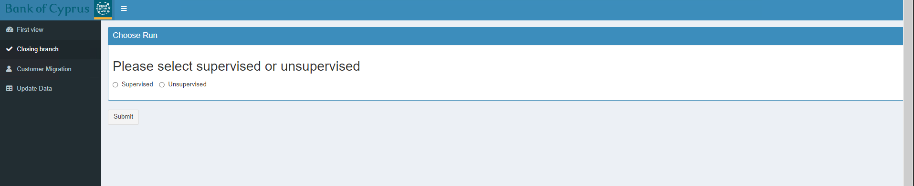
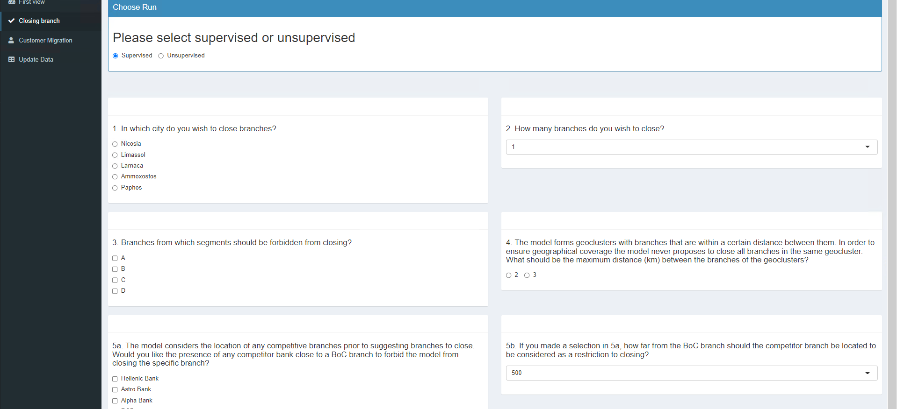
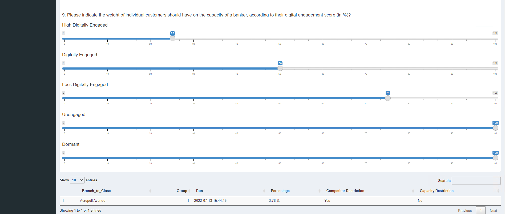

Closing Branch
=====

.. _closing_branch:

This is the main tab when a new branch is needed to be closed.

The user first has to select either of the two options:

* **Supervised:** Select this option if the number of branches to close is known.
* **Unsupervised:** Select this option if the number of branches to close is unknown. This means the algorithm will suggest the optimal branches to close.

A screenshot of these options is shown below:

After selecting an option, more inputs are required for the algorithm to run. These inputs are:

1) In which city do you wish to close branches?
2) How many branches do you wish to close? (If **supervised** option selected only)
3) Branches from which segments should be forbidden from closing?
4) The model forms geoclusters with branches that are within a certain distance between them. In order to ensure geographical coverage the model never proposes to close all branches in the same geocluster. What should be the maximum distance between the branches of the geoclusters? 

5)   
  * The model considers the location of any competitive branches prior to suggesting branches to close. Would you like the presence of any competitor bank close to a BoC branch to forbid the model from closing the specific branch? 
  * If you made a selection in question 5a, how far from the BoC branch should the competitor branch be located to be considered as a restriction to closing?
  
6) Should the model be allowed to close rural branches?
7)  What is the revenue loss (as a % of the total branch revenue) that you expect to have when closing a branch?
8)  Please indicate the maximum number of clients that each banker type may have registered on them (FYI the original direction from Hays was: CSRO: 4500, RRO: 1000, PRO: 800, SBRO: 300).
9) Please indicate the weight of individual customers should have on the capacity of a banker, according to their digital engagement score?

A screenshot of these options is shown below:

After selecting the desired options and clicking the Submit button the result is presented in a table format on the bottom of the page.

A screenshot of a sample result is shown below:

