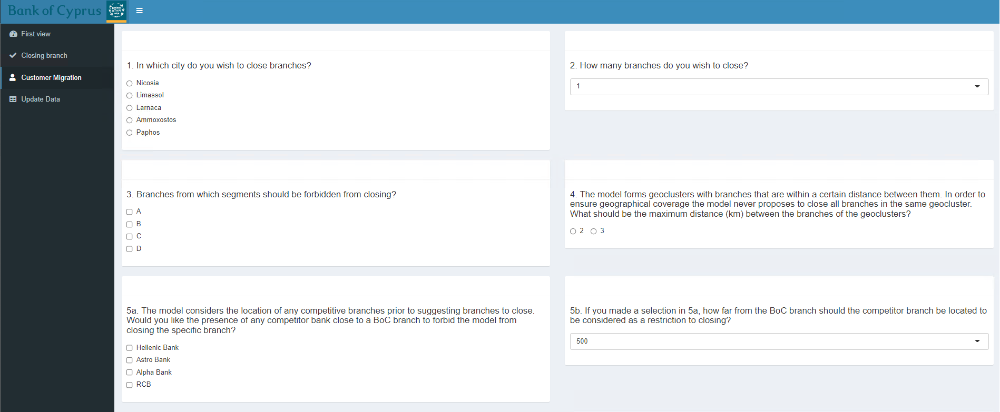
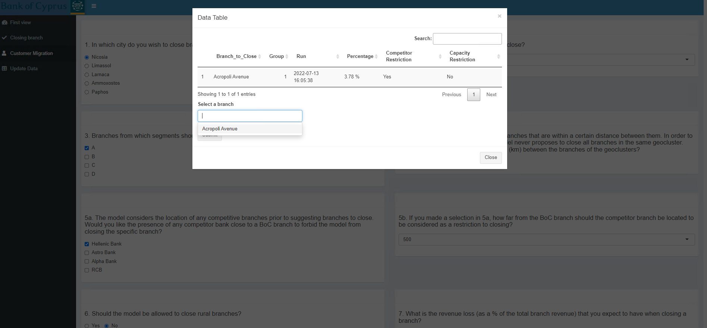
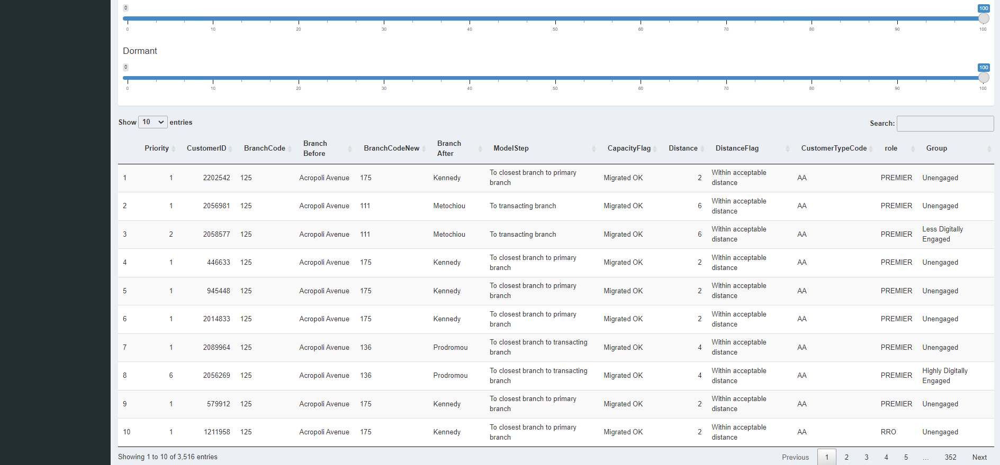

Customer Migration
=====

.. _customer_migration:

This is the main tab when migrating customers of a closed branch to new branches.

The inputs of this tab are the same as the :doc:`closing_branch` tab.

A screenshot of these options is shown below:

After selecting the desired options and clicking the Submit button a popup is presented where the user can select which branch(es) to close. The selection can be made by the dropdown menu. **Please note:** Multiple branches can be selected.

A screenshot of the popup is shown below:

  
  
The final result is presented in a table format below the inputs.
  
  
A screenshot of the result is shown below:

