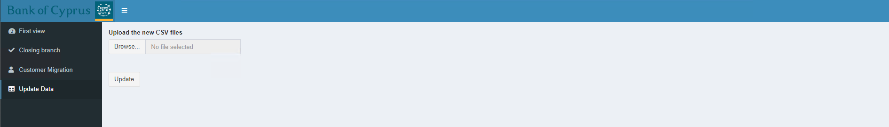

Update Data
=====

.. _update:

This is the main tab when new data are needed to be used by the application. 

To update the data make sure you are using a KPMG laptop and follow these steps:

1) Update ``competitor_branches.csv`` from Komis (BoC branches) and Web (competitor branches)
2) Drop ``dbo.new_iso_branches`` table
3) Insert ``competitor_branches.csv`` as`dbo.new_iso_branches` table
4) Run ``python api_script.py``
5) Run ``python api_script_boc_only.py``
6) Select latest data:

.. code-block:: sql

   SELECT  [branch_id]
      ,[competitor_branch_id]
      ,[distance_m]
      ,[distance_min]
      ,[geo_distance_m]
      ,[created_at]
   FROM [Branch_Optimisation].[dbo].[iso_branches_competitor_district_distances]
   WHERE cast (created_at as date) = '2022-07-11' -- add new Date
   
   
Export result as ``iso_branches_competitor_district_distances.csv`` file

7) Select latest data:

.. code-block:: sql

  SELECT  [branch_id1]
      ,[branch_id2]
      ,[district]
      ,[distance_m]
      ,[distance_min]
      ,[geo_distance_m]
      ,[longitude1]
      ,[latitude1]
      ,[longitude2]
      ,[latitude2]
      ,[created_at]
  FROM [Branch_Optimisation].[dbo].[iso_branches_boc_district_distances]
  WHERE cast (created_at as date) = '2022-07-11' -- add new Date
  
Export result as ``iso_branches_boc_distances.csv`` file.

8) Send the following files to BoC laptop:
    * competitor_branches.csv
    * iso_branches_boc_distances.csv
    * iso_branches_competitor_district_distances.csv
9) Run Shiny and go to update Tab. 
10) Upload CSV files and press Update button. See the screenshot below:

  
