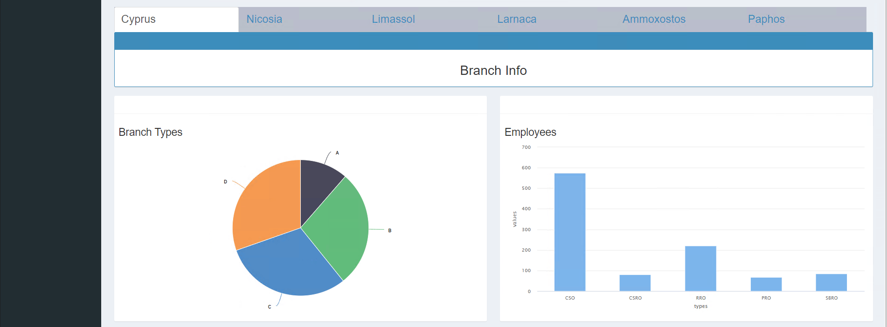
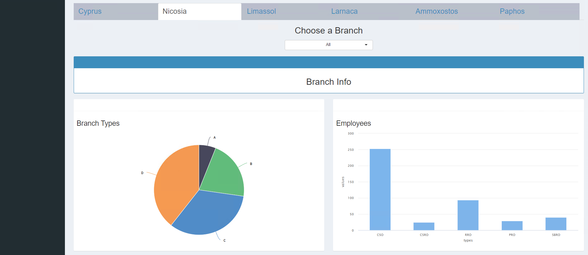

Usage
=====

.. _dashboard:

Dashboard
------------

Map
**********

Also called `First View` contains information about diffent Bank of Cyprus branches along with their competitors.
On the top a map which can show various bank branches (BoC and competitors) with different filters is displayed. These filters are:

1) Show Bank of Cyprus branches per city on the map
2) Show Competitor bank branches on the map
3) Show the driving distance from each branch (**pending**)

A screenshot of the map with the filters can be seen below:

.. image:: images/dashboard1.PNG
  :width: 700
  :alt: First View
  
  
Branch Information
**********

Scrolling down in the dashboard reveals aggregated information about Bank of Cyprus branches. There is a header in which the aggregation can be changed. 

Information can be displayed as `Cyprus` which aggregate information about **all** Bank of Cyprus branches or can select each city individually which is going to aggregate information of the branches for the **city** selected. 

The information which is displayed is:

1) The branch types each city has. If specific branch is selected then this shows the branch type of the selected branch
2) The number of employees
3) The digital engagement of the customers.

The screenshots for **all** branches can be seen below:

  
  .. image:: images/dashboard4.PNG
  :width: 700
  :alt: First View

A screenshot for a specific city (**Nicosia**) branches can be seen below:

Closing Branch
----------------

test

Customer Migration
----------------

test

Update Data
----------------

test
